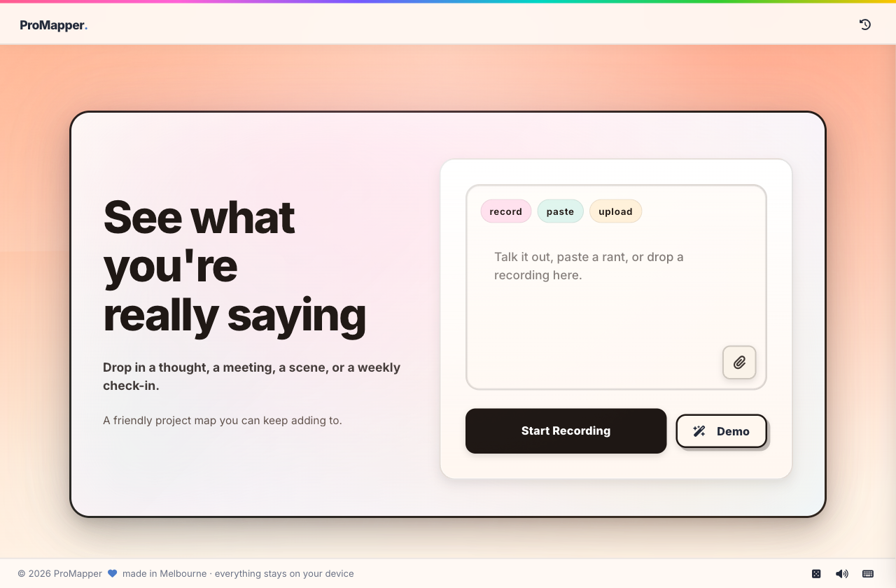
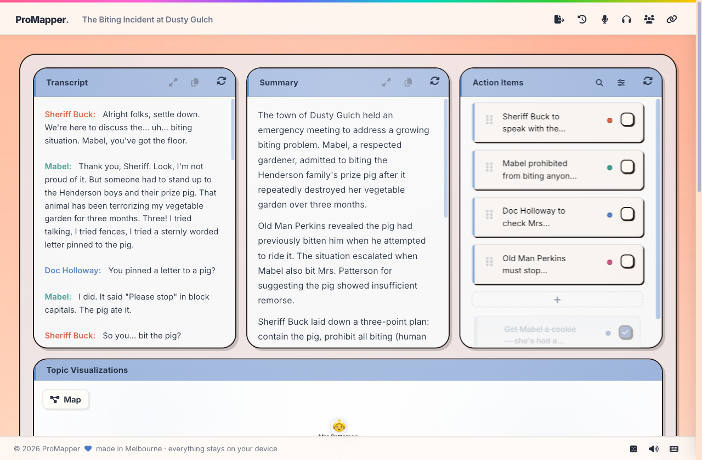
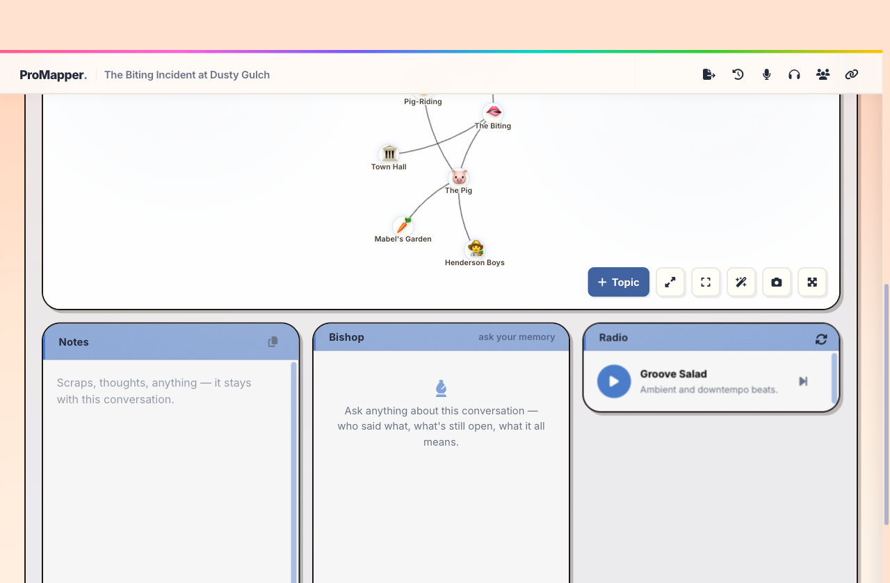
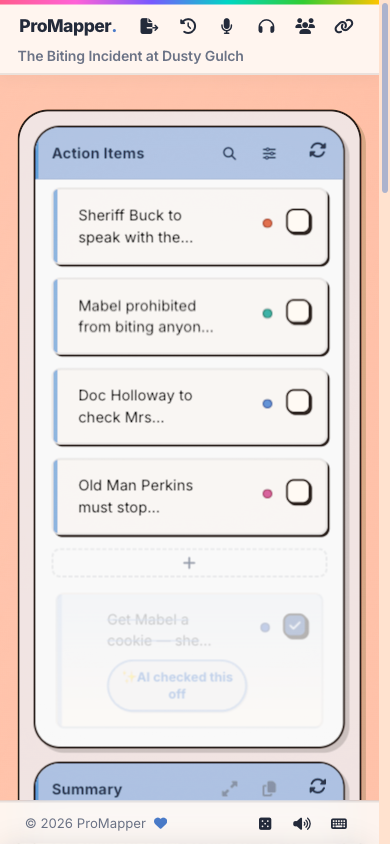

# 🧠 ProMapper

> Turn messy conversations into living project maps.

**ProMapper** is a friendly, local-first workshop table for whatever you're
circling. A voice note, a weekly check-in, a research session, a film scene, a
court case, a messy written rant — put it on the table and it takes shape: a
transcript, a summary, action items, a topic map you can push around, and clean
documents when you need them.

The useful part is that the map keeps growing. Add more talk or text later and
ProMapper folds it into the same map — it keeps up with you instead of starting
over. A band working out a setlist, a thesis pile, a D&D campaign, a kitchen
renovation, a community project: it isn't built for one job. When you discover
what yours is, it becomes yours.

## 📸 A look around

|                                       The front door                                        |                                  The living dashboard                                   |
| :-----------------------------------------------------------------------------------------: | :-------------------------------------------------------------------------------------: |
|  |  |

|                         The module rack                         |                           In a pocket                           |
| :-------------------------------------------------------------: | :-------------------------------------------------------------: |
|  |  |

Every roll of the dice re-tints the whole app from curated color pairs — your
screenshots may be wearing a different sky.

## ✨ Key Features

### 🎤 Capture → Shape

- **Record or upload** audio files
- **Automatic transcription** that tidies the talk and names the speakers
- **Reads the conversation** and pulls out topics, action items, and a summary,
  all at once
- **Real-time visualizer** during recording sessions

### ✅ The list keeps itself honest

Say _"I finished writing that report"_ in a later take and the "Write report"
item quietly ticks itself ✓. If it turns out the thing fell through, it comes
back. New audio and text get read against the open action items, so the list
stays true without you tending it.

### 🕸️ A topic map you can push around

- **Emoji-based nodes** with colored relationship edges, clustering organically
  so interrupted thoughts are easy to circle back to
- **Drag one topic onto another to merge them** — the map learns what you call
  things, so merged topics stay merged as the project grows
- **Flip the map over** and there's a sketchboard — draw the thing the way you
  see it, and it remembers too

### 🎙️ Collaborative Meeting Rooms (Live Mode)

- **Multiplayer sync**: Real-time cursor presence, chat rooms, and named avatars
  (e.g. _"Glitch Koala"_) powered by PartyKit.
- **Shared Whiteboard**: Collaborative sketchpad using Excalidraw — people and
  the board's own helper hand can draw diagrams side-by-side.
- **WebRTC Voice Relay**: Zero-latency P2P voice chat with active speaker
  highlights, powered by Cloudflare RealtimeKit SFU.

### 📤 Markdown Exports

The same map can leave the table as eight different documents: **What got
done**, **Meeting**, **Summary**, **Plan**, **Research**, **Journal**,
**Unasked** (the questions nobody said out loud), and **Haiku** (why not?) —
plus a custom prompt when you want something stranger.

### 🎨 Soft Neo-Toybrut UI

- **Mesh gradient backgrounds** (animated SVG)
- **Tactile Sound FX**: Clientside synthesized Web Audio cues (chimes, ticks,
  whooshes) for interface actions
- **Theme-aware styling**: Sleek, pastel palettes (Bubblegum, Sky, Grape, Lime,
  Gold)
- **Draggable cards** for customizable dashboard layouts
- **Fully responsive** mobile views with CSS momentum scroll-snapping

## 🚀 Quick Start

### Prerequisites

- **Deno** (v1.40+):
  [Install Deno](https://deno.land/manual/getting_started/installation)
- **OpenRouter API Key**: [Get API key](https://openrouter.ai/keys) — one key,
  every model the app uses routes through it

### Setup

1. **Clone the repository**
   ```bash
   git clone https://github.com/pibulus/promapper.git
   cd promapper
   ```

2. **Set up environment variables**
   ```bash
   cp .env.example .env
   ```

   Edit `.env` and add your provider API key:
   ```bash
   OPENROUTER_API_KEY=your_openrouter_api_key_here
   API_AUTH_TOKEN=choose_a_secret_value

   # Optional: per-task model overrides (see CLAUDE.md for the routing table)
   # OPENROUTER_MODEL=google/gemini-3.1-flash-lite

   # Optional: harden server routes & sessions
   ALLOWED_ORIGINS=http://localhost:8003
   API_RATE_LIMIT=60
   API_RATE_WINDOW_MS=60000
   API_SESSION_TTL_MS=14400000
   API_COOKIE_SECURE=false
   ```

3. **Start the development server**
   ```bash
   deno task start
   ```

   The app will be available at `http://localhost:8003`

4. **First API call**

   When you trigger any feature that reads the conversation from the UI, the
   browser will prompt you for the `API_AUTH_TOKEN`. Paste the same value you
   set in `.env`—it’s only used to open a short-lived HttpOnly session cookie,
   so it’s never stored in LocalStorage and you’ll be prompted again when the
   session expires.

   Whenever you stop a clip that’s at least 30 seconds long, we automatically
   save a `.webm` backup in your Downloads folder so you can re-upload if
   anything goes wrong.

### First Use

1. **Record** a conversation or **upload** an audio file
2. Give it a moment to read the conversation (usually 10-30 seconds)
3. **Explore** the dashboard:
   - 📝 Transcript with speakers
   - 📊 A summary drawn from the talk
   - ✅ Action items with assignees
   - 🕸️ Topic relationship graph
4. **Export** to different formats using the drawer
5. **Share** conversations with shareable links

## 📚 Documentation

- **[CLAUDE.md](./CLAUDE.md)** - Development guide for future coding sessions
- **[core/README.md](./core/README.md)** - Framework-agnostic reading-engine
  documentation
- **[GLOSSARY.md](./GLOSSARY.md)** - Terms and file map for the codebase

## 🏗️ Architecture

```
/core/                  # Framework-agnostic reading engine
  ├── ai/              # Provider wrappers & prompts
  ├── orchestration/   # Parallel processing flows
  ├── realtime/        # Share-room protocol and storage adapters
  ├── types/           # TypeScript type definitions
  ├── storage/         # localStorage & share services
  └── export/          # Format transformers

/islands/              # Interactive Preact components (Fresh)
/components/           # Shared UI components
/routes/               # Fresh routes & API endpoints
/signals/              # Global state (Preact signals)
/utils/                # Utility functions
/services/             # Server-side API/auth/audio helpers
```

The core reading engine (`/core/`) is extracted into pure TypeScript and can be
used in **any framework** (React, Vue, Svelte, etc.). Fresh is just the current
UI implementation.

## 🛠️ Development

### Available Commands

```bash
deno task start      # Start dev server (port 8003)
deno task build      # Build for production
deno task preview    # Preview production build
deno task check      # Run linting and type checking
```

### Tech Stack

- **Framework**: [Fresh](https://fresh.deno.dev/) (Deno + Preact)
- **Reading engine**: OpenRouter, with per-task model routing
- **Visualization**: [D3.js](https://d3js.org/) (force-directed graphs)
- **State**: [Preact Signals](https://preactjs.com/guide/v10/signals/)
- **Storage**: LocalStorage, URL shares, optional Supabase share store
- **Styling**: [Tailwind CSS](https://tailwindcss.com/)

## 🎯 Good Fits

- **Weekly projects**: keep actions, summaries, and decisions moving over time
- **Research groups**: turn ongoing conversations into shared context
- **Personal notes**: get a rant, idea, or plan into a shape you can use
- **Scenes and cases**: map who said what, what matters, and what connects
- **Shared work**: send a project map instead of a pile of notes

## 🔐 Privacy

- All processing happens through the provider you configure
- Conversations stored locally in browser (localStorage)
- Small share links use compressed URL data
- Larger share links use `/api/share` with Supabase when configured, or an
  in-process memory store during local development
- No analytics or tracking

## 📝 License

MIT License - see [LICENSE](./LICENSE) file for details

## 🤝 Contributing

[Add contributing guidelines if you want contributions]

## 🙏 Acknowledgments

Built with:

- [Fresh](https://fresh.deno.dev/) - The next-gen web framework
- [OpenRouter](https://openrouter.ai/) - OpenAI-compatible AI gateway
- [Google Gemini](https://ai.google.dev/) - Optional multimodal fallback
- [D3.js](https://d3js.org/) - Data visualization

---

**Made with ☕ and lots of conversations**
